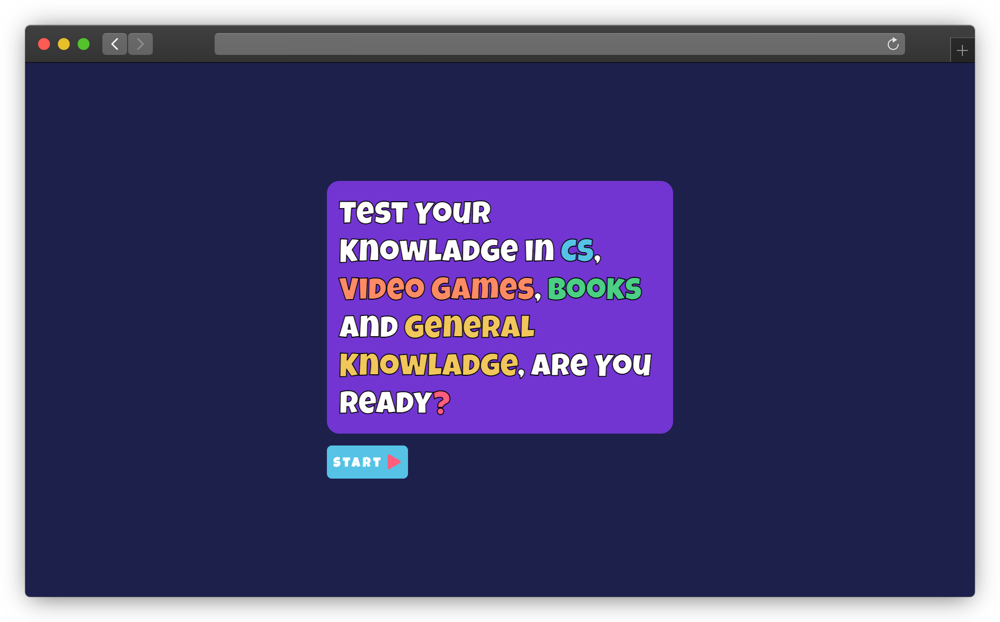
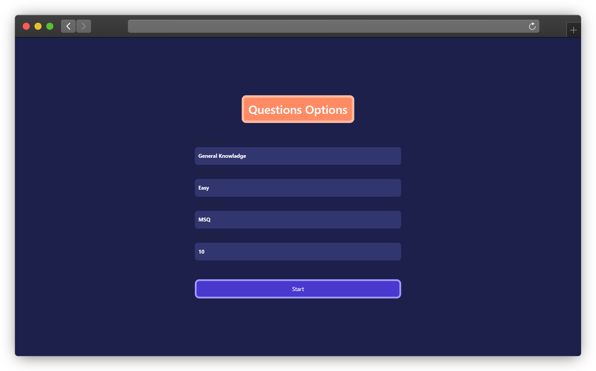
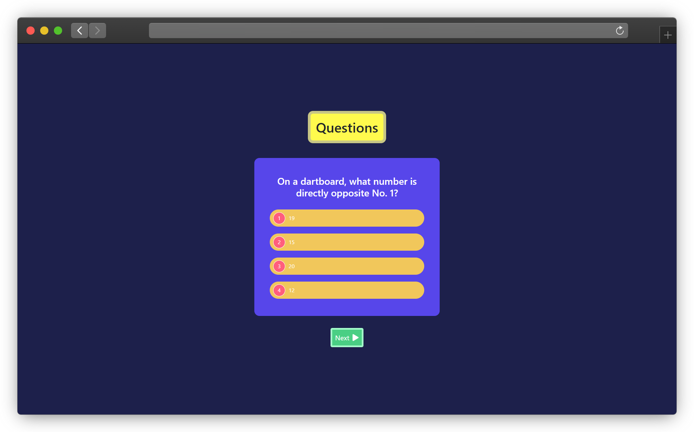
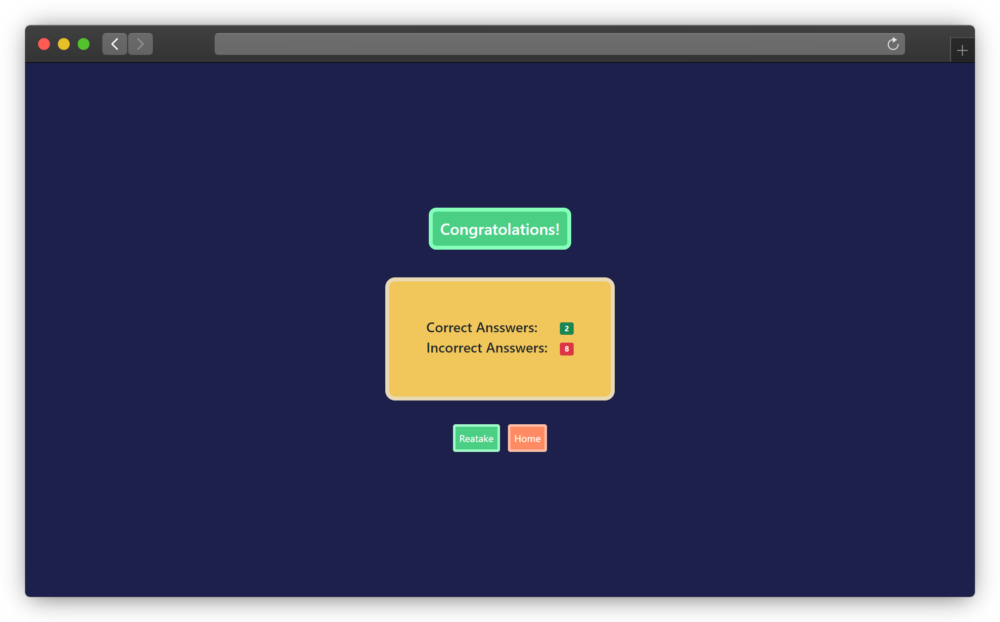

# Shortly Website

By this **Quizz App** You can Test your Self in a lot off categories of questions like Computers, Video Games, Books and General Knowladge.

---

# Discreption

This is a [**Quizz**](https://quizz-app-eta.vercel.app/) web app let you to test your Information in alot of Fileds:

- General Knowladge
- Compouter Science
- Books
- Video Games

And With Two Types of Quesitions:

- **MSQ** Questions
- **True or False** Questions

---

# App Features

- Reponsive
- Nice Design with Bootstrap Framework
- Speed & Good Performance

---

# Languages & Technologies

### Languages That used in this Web App:

  
  
  

### Technolohies that used in this App:

  
  

---

### Other Libs & Packages:

- [**Axios**](https://www.axios.com/)
- [**React Icons**](https://react-icons.github.io/react-icons/)
- [**Styled Components**](https://styled-components.com/)
- [**Lodash**](https://www.npmjs.com/package/lodash)
- [**React Router**](https://reactrouter.com/)

---

# App's Screenshot

  

    
    
  

  

    
    
  

